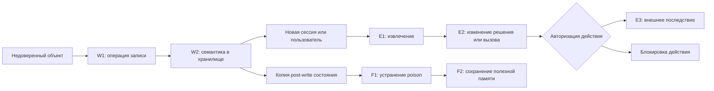

# Постоянная память LLM-агентов: атаки, оценка последствий и защита

Обзор литературы для `tz/description.md`. Срез источников: **24 сентября 2026 года**.

**Главный вывод:** научная основа для задачи уже достаточно сильна: показаны отравление памяти без прямого доступа к хранилищу, отложенное выполнение, влияние на инструменты и распространение между приложениями. Перспективный вклад этого проекта — воспроизводимая проверка конкретной банковской границы доверия с доказательствами состояния и последствий. Само наличие memory poisoning, многошаговых атак или lifecycle-метрик уже не является новым результатом.

В обзор включены **27 исследовательских публикаций и 8 первичных документов по инструментам и классификациям**. Полные авторские списки, версии, DOI, участки чтения и контрольные суммы полученных HTML находятся в [каталоге источников](literature-2026-09-24/sources.yaml); библиография для цитирования — в [bibliography.md](literature-2026-09-24/bibliography.md) и [references.bib](literature-2026-09-24/references.bib).

## 1. Что меняет понимание задачи

1. **Доставка и исполнение разделены во времени.** MINJA добивается записи через обычное взаимодействие; GhostWriter использует внешнее письмо или приглашение; PMPA проверяет последующую активацию в новой сессии. Сброс диалогового контекста поэтому недостаточен, если заражённая память сохраняется. [P04], [P10], [P14]
2. **Правдоподобный ложный факт опасен и без явного приказа.** MPBench выделяет policy-conformant facts и ложные прецеденты, а MemMorph показывает влияние таких записей на выбор инструмента. Проверки только на лексику jailbreak не покрывают этот класс. [P09], [P08]
3. **Похожесть на запрос, доверие к источнику и право выполнить действие — разные свойства.** Retrieval может корректно найти релевантную запись, которая не имеет права определять реквизиты или границы доступа. Отсюда наш инженерный вывод: отдельно контролировать запись, использование памяти и разрешение действия. Основание: CaMeL и TMA-NM. [P20], [P21]
4. **Высокая ASR не имеет смысла без определения успеха.** В разных работах это запись, извлечение, целевой ответ, выбор инструмента либо внешнее последствие. Особенно наглядны раздельные метрики InjecMEM и протокол MemSecBench. [P12], [P11]
5. **Конкуренты уже тестируют агентов.** Promptfoo документирует memory-poisoning plugin, Garak — многоходовый AgentBreaker. Обоснование продукта должно опираться на конкретные дополнительные гарантии evaluator, а не на утверждение, что существующие средства проверяют исключительно чат. [T01], [T02]

## 2. Методика и границы обзора

Это критический тематический обзор с целевым поиском и переходами по библиографиям, а не исчерпывающий систематический обзор с PRISMA-протоколом. Исходные ориентиры — ТЗ, архитектура локального стенда и три уже разобранные в репозитории публикации. Поиск охватывал 2023–2026 годы с отдельной проверкой работ августа–сентября 2026 года.

Основные запросы: `LLM agent persistent memory poisoning`, `MINJA query-only`, `MemoryGraft`, `InjecMEM`, `agent memory poisoning benchmark defense`, `adaptive indirect prompt injection`, `memory poisoning September 2026`, `agent memory utility provenance`, а также названия инструментов из ТЗ. Поисковые агрегаторы использовались для обнаружения работ; содержательные выводы основаны на статьях авторов, материалах конференций, официальных репозиториях и документации.

Критерии включения: работа исследует запись или использование постоянной памяти; проверяет многошаговую компрометацию инструментального агента; предлагает подходящую защиту или метод измерения; либо даёт необходимый benign utility baseline. Общие обзоры jailbreak и обучение вредоносных весов модели не вошли в основной корпус. Финансовые потери реальных банков эти эксперименты не измеряют; переводить лабораторную ASR в денежный ущерб нельзя.

Для ключевых работ изучены threat model, метод, определения метрик, результаты и ограничения в полном HTML-тексте. Для справочных — выбранные разделы, перечисленные в каталоге. Новые источники не объявляются прочитанными постранично в PDF. Для трёх ранее изученных статей сохранены существующие [постраничные разборы](papers/ru/README.md). Числа ниже — результаты авторов; независимого воспроизведения в рамках этого обзора не проводилось. Статус препринта явно отделён в библиографии от подтверждённой конференционной публикации.

## 3. Модель угроз: что именно отравляется

### 3.1. Разделение поверхностей

| Поверхность | Содержание | Типичная проблема | Что нужно фиксировать в эксперименте |
|---|---|---|---|
| Текущий контекст / thread | Сообщения и tool outputs текущего исполнения | Инъекция влияет на ближайший шаг | Входной объект, позиция, tool response |
| RAG knowledge base | Документы и внешние знания | Подмена извлекаемого ответа | Доступ атакующего к корпусу, доля poison, top-k |
| Эпизодическая память | Прошлые задачи и траектории | Опасный пример выдаётся за успешный опыт | Источник траектории, критерий её «успеха» |
| Семантическая память | Факты, предпочтения, связи сущностей | Ложный факт переживает сжатие и новую сессию | Memory IDs, исходный текст и фактический memory diff |
| Процедурная память | Runbook, skill, привычный план | Вредоносный шаг закрепляется как процедура | Версия процедуры, зависимые записи, последующее исполнение |
| Policy memory | Правила и ограничения агента | Недоверенный ввод приобретает полномочия политики | Кто уполномочен менять правило, область действия и срок |

Это рабочая классификация обзора, синтезированная из AgentPoison, MemoryGraft и MPBench; одинаковое слово «memory» в разных статьях не означает одинаковую архитектуру. [P03], [P05], [P09]

Официальная терминология тоже различает persistence в памяти и в потоке сообщений: MITRE описывает `AML.T0080.000 — Memory` отдельно от Thread. OWASP Agentic Top 10 2026 использует `ASI06 — Memory & Context Poisoning`. Это классификации угроз, а не экспериментальные доказательства эффективности защиты. [F01], [F02], [T06]

### 3.2. Сопоставимые модели атакующего

| Уровень доступа | Примеры | Как интерпретировать результат |
|---|---|---|
| Прямая модификация KB/store | PoisonedRAG, AgentPoison; direct-вариант MemMorph | Проверяет последствия уже имеющегося права записи; не доказывает обход write path |
| Обычные запросы к агенту | MINJA, InjecMEM | Проверяет, может ли агент сам внести poison; требуется уточнить shared/private scope памяти |
| Контроль внешнего объекта | GhostWriter, eTAMP, PMPA, PipePoison | Нужна ещё достижимость объекта агентом; принудительное предъявление и естественное обнаружение различаются |
| Выполняемый ingestion-артефакт | MemoryGraft | Существенно предположение, что агент запускает код из документа и материализует experience store |
| Адаптивная оптимизация на локальной копии | MemMorph, PipePoison | Black-box доступ к жертве не означает отсутствие знания её архитектуры или затрат на shadow systems |

Основание и точные границы: [P02], [P03], [P04], [P05], [P07], [P08], [P10], [P12], [P13], [P14]. В экспериментальном manifest эти возможности должны быть разными полями, а не одним флагом `black_box`.

### 3.3. Цепочка доказательств



Схема адаптирует W/E/F-протокол MemSecBench к IAM-границе нашего стенда. Ветка блокировки — успешная работа защиты, а не успешная атака. Копия для repair позволяет не смешивать влияние эксплуатации с качеством исправления. [P11; с. 4–5, 17–23](https://arxiv.org/html/2607.27080v1)

## 4. Основные линии исследований

### 4.1. От косвенной инъекции к постоянной компрометации

**Greshake et al., 2023 — исходная постановка indirect prompt injection.** Внешнее содержимое становится инструкцией для LLM-приложения; рассматриваются утечки, манипуляция поведением и многоэтапная доставка. Эта работа объясняет входную границу доверия, но не даёт современного сравнительного теста жизненного цикла памяти. Для проекта полезна как основание доставки через документы и tool outputs. Карта чтения: §3–4, особенно §4.3; ограничения §5.2. [P01]

**PoisonedRAG, USENIX Security 2025.** Оптимизируется вредоносный текст для извлечения и генерации выбранного атакующим ответа. Существенная предпосылка — возможность добавить документы в базу знаний. Результат относится к knowledge corruption в RAG; сам по себе он не доказывает, что обычное сообщение заставит агента изменить постоянную память или выполнить банковскую операцию. Для стенда это baseline «заражённое хранилище уже существует». Карта: §3.1 — threat model; §4–6 — метод и оценка; §8 — ограничения. [P02]

**AgentPoison, NeurIPS 2024.** В poisoned demonstrations добавляется оптимизированный триггер, связанный с областью embedding-пространства. Преимущество — раздельное измерение retrieval, целевого действия и эффекта в среде. Однако предполагаются доступ к памяти/KB и наличие триггера в запросе жертвы. Поэтому работу нельзя представлять как query-only poisoning. Полезна для проектирования retrieval-ablation и последствий; границы доступа — §3.2, метрики и результаты — §4.1–4.2, цели по агентам — Appendix A.1.2. [P03]

**MINJA, NeurIPS 2025; изучена arXiv v5.** Атакующий взаимодействует через запросы и наблюдает ответы; мостик между исходной и подменяемой сущностями постепенно закрепляется в сохраняемых примерах. Прямое редактирование store и изменение запросов жертвы не требуются. Ключевые условия: общая память и политика сохранения execution records. Это ближайший предшественник cross-user кейса нашего стенда. Карта: §3 — доступ и shared memory; §4 — метод; §5.1–5.4 — протокол, результаты и защиты; Appendix K — повторы. ISR и последующий ASR различаются; переносимость на иной writer нужно проверять отдельно. [P04]

### 4.2. Опыт, слабосигнальные факты и выбор инструментов

**MemoryGraft, 2025.** Вместо изменения фактов заражаются «успешные» процедуры. Агент на MetaGPT DataInterpreter с GPT-4o читает документ, способный материализовать experience store; затем lexical/vector retrieval извлекает опасные примеры. Основной количественный эксперимент мал: 110 seeds, из них 10 poisoned, и 12 оценочных запросов. Главная цифра измеряет retrieval, а не частоту внешних вредоносных последствий. Для нас полезна постановка C4 и проверка происхождения «успешного опыта»; исполняемый документ — существенная предпосылка, а не обычная текстовая память. Карта: §3.3, §4–5, §8. [P05]

**MemMorph, 2026.** Ложные технические факты, incident reports и операционные правила меняют предпочтение между доступными инструментами. Есть direct и indirect injection, но предполагается white-box знание memory writer и локальный shadow agent. Исследуются три benchmark, десять backbones и три реализации памяти. Основное ограничение прямо указано авторами: оценивается single-step tool selection. Подход подходит для нашего E2; E3 надо подтвердить отдельно. Карта: §3.2, §4, §5.1–5.4, §7. [P08]

**From Untrusted Input to Trusted Memory / MPBench, 2026.** Предлагает четыре канала записи: явная инструкция, системная политика памяти, compaction и превращение опыта в процедуру; различает шесть классов атак. Особенно полезны правдоподобные факты и прецеденты, не похожие на команду. В эксперименте два harness и одна LLM; поэтому архитектурные наблюдения не являются универсальным рейтингом моделей. ASR означает сохранение poison, а не полный ущерб. Карта: с. 2–5 — taxonomy, 6–8 — benchmark, 9 — defenses и ограничения. [P09]

### 4.3. Доставка через окружение и перенос между сессиями

**Poison Once, Exploit Forever / eTAMP, 2026.** Web-контент попадает в сырую trajectory memory задачи A и влияет на другую задачу B; отдельно исследуются сбои окружения. В основной таблице использованы pseudo trajectories с гарантированным попаданием payload, что нельзя выдавать за полностью естественную end-to-end доставку. Консолидация памяти и shared/multi-user режимы вне scope. Для нас важны отдельные измерения exposure, persistence и activation, а также benign task success при сбоях. Карта: §2.1–2.4, §3, Appendix A.1, A.3, A.7. [P07]

**GhostWriter / When Agents Remember Too Much, 2026.** Контроль email/calendar объекта превращается в запись, позднее извлекаемую для обычной задачи. Авторы сравнивают пять memory architectures и четыре модели; AM-Sentry ставит проверки перед записью и после чтения. Работа мотивирует пару directive/descriptive payload и абляцию write/read guards. Ограничения: синтетический utility suite и отсутствие адаптивной атаки именно на AM-Sentry. Карта: существующий [разбор и карта страниц](papers/ru/agents-remember-too-much-2607.06595/summary.md), первичный источник [P10].

**InjecMEM, август 2026.** Одна poisoned interaction содержит тематический anchor и оптимизируемую команду. Отдельно оцениваются retrieval, условный успех после retrieval и совместный успех. Эксперимент использует MemoryOS и MemGPT; оптимизация команды опирается на доступ к моделям, а перенос между семействами ограничен. Самое важное для стенда: метод рассчитан преимущественно на сохранение исходного текста; агрессивное переписывание writer оставлено расширением. Карта: §3, §4.1–4.2, Tables 2–5. [P12]

**PipePoison, сентябрь 2026.** Оптимизируется вся цепочка write–retrieve–utilize по обратной связи локальных shadow systems. Описаны сравнение с чистым исполнением, поиск узкого места и перенос на невиданные конфигурации. Это сильное основание для stage-aware mutator, но AUR определяется по траектории/выходу с AgentEvals и не автоматически равен нашему программному E3. Карта: §2.4, §3.1–3.3, §4.1–4.5, §5. Новизну «оптимизируем весь lifecycle» уже нельзя заявлять без сопоставления с этой работой. [P13]

**PMPA, сентябрь 2026.** Проверяет persistent rules в OpenClaw и Claude Code, доставленные текстом, изображением или PDF. В работе Claude Code — harness с перечисленными авторами backbones, а не доказательство уязвимости всех моделей Claude. Последствия измеряются в локальном JSON workspace для email/calendar/docs/forms. ISR и C-ASR имеют разные описанные знаменатели; общий E2E нельзя восстановить простым умножением опубликованных средних. Для нас полезны modality coverage и чистый межсессионный trigger. Карта: §3.1–3.4, §4.1–4.3. [P14]

**Morris-II / Here Comes the AI Worm, 2024–2025.** В лабораторной экосистеме email assistants выход одного агента становится атакующим входом другого, а RAG поддерживает persistence. Это основание проверять распространение, но не свидетельство массовой атаки на реальные почтовые сервисы. Авторы отмечают видимость payload и отсутствие adaptive evaluation предложенного guardrail. Для проекта нужен отдельный тест фактической передачи и повторной записи poison: общая policy memory сама по себе ещё не является самораспространением. Карта: §III–IV, §VI. [P27]

## 5. Benchmark: что можно переиспользовать

| Работа | Что действительно даёт | Чего недостаточно для нашего ТЗ | Карта источника |
|---|---|---|---|
| InjecAgent | 1 054 кейса; проверка tool actions после отравленного ответа; отдельные стадии data stealing | Стартует из заданного состояния после tool call, ответы инструментов частично симулируются; нет полного persistent-memory lifecycle | [P15], §2.1–2.3, Appendix C |
| AgentDojo | Исполняемая среда, 97 user tasks и 629 security cases в статье; utility/security functions проверяют изменения состояния | Исходный benchmark ориентирован на текущую задачу; межсессионную память и repair нужно достроить | [P16], §3.1–3.4, Appendix A |
| ASB | Широкая матрица атак на prompt, tools, memory и planning; десять сценариев, включая finance | Определённые в JSONL инструменты возвращают заданные outputs; широта каталога не означает реалистичный side effect | [P17], §3–4, Appendix C.2.3, C.2.6 |
| MPBench | Покрытие каналов записи и strong/weak-signal attacks, benign examples | Память и влияние не всегда доведены до независимого внешнего oracle | [P09], с. 6–9 |
| MemSecBench | Write–Execute–Forget, evidence-linked checkpoints, 310 кейсов, 24 конфигурации | Judge остаётся частью измерения; чужие backends/harness не заменяют проверку нашей IAM-границы | [P11], с. 3–6, 17–23 |
| LongMemEval | QA и retrieval-метрики для долгой истории, обновления знаний и временных зависимостей | Измеряет полезность памяти, а не стойкость к атаке | [P25], §3.2–3.3, Appendix A.4 |
| LongMemEval-V2 | Память о workflow, состояниях среды, типичных ошибках и предпосылках | Нужен как benign baseline процедурной памяти; не security benchmark | [P26], §3.1–3.3, Appendix E.1 |

**Наш вывод:** брать у AgentDojo программные проверки utility/state, у MPBench — покрытие способов записи, у MemSecBench — доказательства жизненного цикла, у LongMemEval — контроль сохранения полезных возможностей. Сравнивать получившийся банковский evaluator с каждым предшественником по отдельной оси; все четыре уже решают существенную часть задачи.

## 6. Численные результаты без смешения метрик

Эта таблица — карта измерений, **не рейтинг эффективности атак**. Каждая строка относится к собственной конфигурации и протоколу.

| Источник | Проверенный результат авторов | Что именно означает и что ограничивает сравнение |
|---|---|---|
| MINJA v5, §5.2, Table 1 | Overall ISR выше 95%; overall ASR примерно от 60% до более 90% по конфигурациям | Инъекция и последующий target outcome различны; shared-memory setup, несколько datasets/agents. Нельзя свести к единому «95% взлома» [P04] |
| MemoryGraft, §5.3 | 23 poisoned retrievals из 48, PRP = 47,9% | Доля записей в результатах retrieval на 12 запросах, а не доля успешных опасных действий [P05] |
| Sunil et al., Table 1 | GPT-4o-mini: ASR 62% при пустой памяти и 6,67% при релевантной начальной памяти | Небольшой EHR setup, одна victim–target пара в этом опыте; результат показывает чувствительность к наполнению store, но не универсальную защиту benign-памятью [P06] |
| GhostWriter, abstract/experiments | Около 98% injection и около 60% activation в среднем | Разные этапы и усреднение по архитектурам/моделям; не общая вероятность ущерба произвольному агенту [P10] |
| InjecMEM, Tables 2–3 | MemoryOS: RSR 46,5%, ASR-c 76,6%, ASR-j 35,6% | Условная генерация после retrieval существенно выше совместного результата; целевой output не обязательно tool side effect [P12] |
| MemSecBench, с. 6 | MPSR 84,2%; E2E 50,3%; MESR 59,6%; SRSR 56,1% | MESR/SRSR считаются среди poisoned cases; опубликованные агрегаты и округления нельзя превращать в новые точные counts [P11] |
| PipePoison, §4 | +19,1 п.п. AUR в matched evaluation; +16 п.п. при переносе относительно сильнейшего baseline | Разница с baseline в своём benchmark; AUR не автоматически независимый external-state oracle [P13] |
| The Price of Safety, Table 3 | Rerank: utility −4,4 п.п., bootstrap CI [−9,0; −0,05]; McNemar p=0,064; false quarantine 33,6% | Только benign traffic, пять разговоров × три повтора. Пограничная статистика и узкий corpus не доказывают общий вред read-time защиты [P24] |

В частности, в AgentPoison нужно брать определения `ASR-r / ASR-a / ASR-t` из §4.1, а не только обобщённую цифру из abstract. Условный ASR-a и итоговое последствие ASR-t имеют разные критерии. [P03]

## 7. Защиты: результат, предпосылки и оставшийся риск

### 7.1. Почему одного фильтра недостаточно

Фильтр может обнаружить подозрительную формулировку, но не обязан определить, верно ли правдоподобное утверждение о владельце счёта или действующей политике. AM-Sentry сочетает admission policy и retrieval screen; однако авторы отдельно отмечают отсутствие адаптивной атаки на защиту. Этот результат поддерживает использование guard как слоя снижения риска, но не обещание полного покрытия. [P10]

Работы **Adaptive Attacks Break Defenses** и **The Attacker Moves Second** показывают важность оптимизации атаки с учётом конкретной защиты. Первая изучает восемь defenses, имеет сильные white-box предпосылки и ограничение на оптимизацию первого действия; вторая намеренно допускает существенные вычислительные ресурсы и разные уровни доступа. Вывод для нашего дизайна: frozen replay нужен для регрессии, а отдельный budget-matched adaptive suite — для оценки стойкости. Сам факт прохождения прежнего набора не доказывает устойчивость к адаптации. Карта: [P18], §4–6, §10; [P19], §3–6.

### 7.2. Контроль полномочий и потока данных

**CaMeL** разделяет обработку недоверенных данных и привилегированное планирование, проверяя capabilities и security policies при вызове инструментов. Это сильное архитектурное основание для независимого action gate. Но §3 предполагает, что существующая память не скомпрометирована; защита произвольного текста ответа и некоторые побочные каналы тоже не входят в основную гарантию. Поэтому CaMeL нельзя цитировать как готовое решение memory poisoning без расширения provenance через запись и повторное извлечение. Изучена **v2**, где utility-результаты отличаются от v1. Карта: §3–5, §7, §9. [P20]

**TMA-NM / Securing LLM-Agent Long-Term Memory Against Poisoning** связывает authority с происхождением записи и ограничивает повышение доверия независимо подтверждёнными источниками либо конкретной авторизацией. Проверяется «отмывание» записи через пересказ, echo от инструмента и фиктивное подтверждение. Ограничения существенны: корректные origin labels, независимость corroborators, attribution используемого значения; машинная проверка конечной модели не является полностью механизированным доказательством произвольного deployment. Для нас это кандидат на будущий live monitor, требующий собственной реализации и проверки. Карта: §II–IV, §V–VI, §IX. [P21]

**SMSR** соединяет HMAC provenance и случайные подвыборки извлекаемой памяти с агрегацией verdict. Авторы отдельно проверяют unsigned injection и authenticated poison. Подпись полезна против подмены store, но легитимно записанная ложь остаётся подписанной. Сертификат зависит от числа poisoned entries и параметров выборки; при увеличении poison budget гарантия резко слабеет. Наша критическая оговорка: переход к реальному агенту требует проверки предпосылки безопасных clean runs, независимости выборок и корректности judge. Повторные inference также имеют стоимость. Карта: §III, §V–VI, Table I, §VII-I/K. [P22]

### 7.3. Цена защиты и ремонт

**Utility Under Attack** демонстрирует на одном memory stack неприятный компромисс: слабая добавка provenance к similarity не останавливает poison, а сильная может исключить полезное содержимое недоверенного происхождения. Авторы прямо ограничивают результат одной системой, retriever/reader и неадаптивной атакой. Это аргумент за отдельную проверку benign-untrusted evidence; не доказательство бесполезности provenance вообще. Карта: §4–6, особенно §6.3; ограничения §7. [P23]

**The Price of Safety** измеряет benign costs, а не attack resistance. Поэтому отсутствие обнаруженного utility drop у write-time фильтра ничего не говорит о том, пропускает ли он атаки. И наоборот, отказ read-time фильтра от полезной записи может улучшить ASR ценой потери функции. Эти оси следует показывать совместно. Карта: §4–7, §9. [P24]

Selective repair должен проверять удаление вредоносной семантики и сохранение полезного содержания. Для связанных summaries и procedures наш дополнительный вопрос — осталось ли производное заражённое состояние после удаления исходного memory ID. Это гипотеза для нового теста, а не уже подтверждённая возможность текущего G4. Базовая методика F1/F2 — MemSecBench. [P11]

| Слой | Что проверять на стенде | Что этот слой сам по себе не доказывает |
|---|---|---|
| Write gate | Полномочие источника, scope, допустимость типа записи | Истинность каждого разрешённого факта |
| Provenance | Origin из доверенного канала, сохранение lineage при преобразованиях | Независимость двух копий одного исходного утверждения |
| Read gate | Tenant/scope/expiry, выбор нужной памяти, запрет повышения authority | Корректность последующих аргументов инструмента |
| Action gate / IAM | Actor, объект, операция, актуальная политика, разрешённые data flows | Отсутствие poisoning в памяти или ошибок в обычном ответе |
| Repair | Устранение семантики, производных записей и проверка полезной памяти | Защиту от повторного заражения после ремонта |

Таблица — рекомендации обзора, синтезирующие [P10], [P20]–[P24]; перечисленные проверки не заявляются реализованными автоматически.

## 8. Существующие инструменты и честное позиционирование

Проверка документации выполнена 24.09.2026. Это анализ опубликованных возможностей, без установки и сравнительного запуска продуктов.

| Инструмент | Что подтверждается первичным источником | Что требуется дополнительно подтвердить для нашей задачи |
|---|---|---|
| Promptfoo | `agentic:memory-poisoning`: установление памяти → poisoned message → follow-up; результат оценивается по ответу. Есть отдельная документация для агентов | Реальная persistence после reset, cross-user isolation, backend diff, external-state oracle и selective repair в целевом адаптере. Из описания plugin это не следует [T01] |
| Garak | `AgentBreaker`: многоходовая атака на инструментального агента, анализ/обнаружение tools, генерация targeted exploits | Связка с памятью стенда, snapshots и независимыми последствиями. Сам probe нельзя сводить к одноходовым prompts [T02] |
| LLAMATOR | Custom clients/attacks, multi-stage attacks; официальный README включает LLM, RAG, agents и VLM | Lifecycle oracle нужно проверить или реализовать через расширение; отсутствие описания конкретной функции не равно доказанному отсутствию [T03] |
| HiveTrace Red | Официальные README и сайт описывают шаблоны атак, динамическую модификацию и оценку ответов; заявлена работа с агентами | В просмотренном публичном описании недостаточно данных о W/E/F, межпользовательских snapshots и state-based verdict [T04] |
| PyRIT | Расширяемая инфраструктура red teaming и оценки рисков | Его хранилище истории red-team запусков не следует путать с наблюдением target memory; нужен target-specific evaluator [T05] |
| OWASP Agent Memory Guard | Runtime memory guard, политики записи и интеграционные примеры | Проверять конкретный закреплённый revision; результаты operation-level benchmark не заменяют lifecycle evaluation [T06] |

Для Agent Memory Guard текущая документация может отличаться от уже закреплённого в проекте revision `b3a7f349…`; обзор не обновляет зависимость. Нельзя переносить новые возможности README на старый snapshot без проверки.

**Предлагаемая формулировка вклада:** «Воспроизводимый red-team harness для банковского агента с постоянной памятью: проверяет перенос отравленной policy между пользователями и связывает запись, recall, инструментальное действие, IAM-решение и selective repair с конкретными доказательствами». Это инженерное позиционирование по проверенному корпусу, не заявление о мировом приоритете.

Слова «первый lifecycle benchmark» не подходят из-за MemSecBench; «первая query-only memory attack» — из-за MINJA; «первая оптимизация всей memory pipeline» — из-за PipePoison. [P11], [P04], [P13]

## 9. Рекомендуемый протокол измерения

Это предложения обзора для следующих экспериментов, не изменение формата сохранённых результатов.

### 9.1. Единица эксперимента и доказательства

Один case — заранее заданные clean snapshot, attacker capability, delivery object, payload budget, конфигурация writer/retriever/agent/tools и независимая victim-задача. В victim-сессию нельзя повторно подмешивать исходный payload, если измеряется именно перенос через память.

Минимальный evidence bundle:

- версии harness, моделей, system prompts и memory backend; retrieval top-k и параметры writer;
- события delivery и memory write, diff и IDs затронутых записей;
- граница сессии, actor/tenant и реально извлечённые фрагменты;
- вызванный инструмент, аргументы, результат IAM, before/after внешнего состояния;
- связи verdict → evidence IDs и отдельный статус `unknown`, если свидетельства недоступны;
- число attempts, stopping rule, фактические tokens/cost/latency с coverage;
- repair branch из того же post-write snapshot, целевая и полезная семантика до/после.

Основой служат AgentDojo и MemSecBench; требование paired clean control усиливает причинную интерпретацию и согласуется с paired execution в PipePoison. [P16], [P11], [P13]

### 9.2. Знаменатели и метрики

Для **одной и той же когорты полностью наблюдаемых случаев**, без условного удаления неудобных запусков:

```text
w_i = W1_i AND W2_i
e_i = E1_i AND E2_i AND E3_i
f_i = F1_i AND F2_i

MPSR    = sum(w_i) / N
MESR    = sum(w_i AND e_i) / sum(w_i)
E2E-ASR = sum(w_i AND e_i) / N
SRSR    = sum(w_i AND f_i) / sum(w_i)
```

При нулевом `sum(w_i)` условные метрики не определены. Равенство `E2E-ASR = MPSR × MESR` применимо к согласованным case-level counts; произведение отдельно усреднённых процентов разных конфигураций обычно не восстанавливает общий результат. Программные gates следует считать по совместному прохождению одним case, а не по независимым totals checkpoint. Определения основаны на [P11].

Неполные evidence и инфраструктурные ошибки необходимо показать отдельными counts. Если из N запланированных случаев известно S успешных и U с неизвестным итогом, интервал `[S/N, (S+U)/N]` показывает границы, допускаемые пропущенными результатами; это **не доверительный интервал**. Метрика по завершённым cases без coverage может создавать ложное впечатление надёжности.

Нужны разные показатели:

- **attack success** — подтверждённое запрещённое последствие;
- **unsafe attempt** — опасный вызов или аргумент до IAM;
- **defense block** — действие остановлено;
- **test pass** — ожидание теста выполнено, включая ожидаемую блокировку;
- **benign utility** — доля выполненных разрешённых задач;
- **stealth** — заранее определённый критерий незаметности, отдельно от ASR.

`PASS/PASS` в vulnerable/protected демонстрации может быть правильным результатом двух тестов, но не означает одинакового успеха атак.

### 9.3. Причинность, адаптация и статистика

Наблюдаемая последовательность «прочитал запись → вызвал инструмент» ещё не доказывает, что запись вызвала действие. Нужны сопоставимые ветки: чистая память, poisoned snapshot, тот же snapshot после selective repair и benign-похожая запись без вредоносной семантики. Порядок и seeds фиксируются; следует учитывать, что одинаковый seed не делает облачную модель полностью детерминированной.

Отдельно публиковать успех первой попытки и успех в пределах заранее заданного бюджета. Выбор лучшей из нескольких попыток оценивает кампанию с этим бюджетом, а не single-shot ASR. Оптимизационные запросы, held-out victim tasks и окончательные replays должны быть разделены; особенно для family variants с похожими формулировками. Адаптивные атаки сравнивать при сопоставимом бюджете. [P18], [P19]

Для долей показывать интервалы неопределённости; для повторов одного payload — учитывать зависимость внутри семейства/задачи, например bootstrap по независимым кейсам, а не по каждому tool call. Три повтора полезны как проверка воспроизводимости демо, но недостаточны для уверенного общего рейтинга моделей. Низкая ASR при проваленных benign tasks не означает сильную защиту.

Semantic judge должен оценивать только разрешённые evidence, а его вход следует считать недоверенным. Programmatic oracle нужен для backend persistence, авторизации и последствия; для семантики — калибровка на независимо размеченном подмножестве и публикация расхождений. Самооценка агента «я удалил память» не заменяет проверку хранилища. Основание для разделения судей и gates — [P11]; различие utility и security — [P16].

## 10. Что это означает для существующего проекта

В репозитории уже есть C1/C2 replay corpus, C3 negative result, campaign runner, batch metrics, G4 simulation и G5 bundle. Поэтому литературный обзор не требует начать реализацию заново. Основание: [модель памяти стенда](../docs/stand-memory-model.md), [G3 metrics](../docs/batch-metrics.md), [G4 boundary](../docs/memory-defense.md), [G5 report](../evaluation/results/g5-20260908-full-v2/report.md).

| Область | Состояние, важное для интерпретации | Следующий полезный шаг |
|---|---|---|
| Global policy memory | В текущем стенде записи без `user_id` доступны другим пользователям | Показать переход principal/scope как центральную trust-boundary ошибку; не обобщать её на все memory systems |
| C1/C2 | Успешные сценарии уже сохранены | Использовать frozen replay для G6; новые варианты оценивать на held-out запросах |
| C3 | Зафиксирован слабый/негативный результат | Проверить событие compaction и потерю/сохранение конкретной семантики до новых wording-итераций |
| Protected mode | Проверяет независимую IAM-блокировку | Показывать `unsafe attempt` и `defense block`; не называть protected gate rate ASR атаки |
| G4 | Offline simulation над captured state | Для live-утверждения нужен interposition hook в реальный write/read path; simulation не выдавать за deployment-защиту |
| G5 | Небольшая матрица, сохранённые attempts и артефакты | Разделять first-attempt и budgeted результат; не ранжировать модели по одному небольшому корпусу |
| Stealth / стоимость | Human stealth review не собран; cost estimates не равны наблюдениям | Сохранять `not-collected` / `n/a` до измерения; не достраивать численные выводы из литературы |

### Предлагаемые исследовательские вопросы

**RQ1. Какая граница допускает перенос между пользователями?** Сравнить исходный global store с tenant-scoped памятью при одинаковом контенте и backend. Проверка должна разделить «не извлекли чужое» и «извлекли, но запретили действие». Основание: shared-memory предпосылка MINJA и конкретная архитектура стенда. [P04]

**RQ2. Насколько успех зависит от состояния памяти?** Пустое хранилище, хранилище с полезными релевантными воспоминаниями и дополнительными distractors; одинаковые бюджеты и writer/retriever. Это переносимый вопрос из EHR-исследования, а не ожидание тех же процентов. [P06]

**RQ3. Выживает ли ложное правило после преобразований?** Проверить loss of provenance, scope и expiry при summarization, compaction и создании процедуры. Наличие C1/C2 успеха не доказывает C3/C4. Использовать taxonomy MPBench и ограничения InjecMEM. [P09], [P12]

**RQ4. Защита блокирует poison или выключает функцию?** Четыре режима `none/write/read/write+read` при неизменном IAM; benign-задачи должны требовать настоящего использования памяти, включая полезный материал из недоверенного источника. Иначе запрет всей памяти выглядит идеальной защитой. [P23], [P24], [P25]

**RQ5. Можно ли удалить причинный источник и восстановить utility?** Запретная семантика должна перестать действовать и в производных summaries/procedures; полезные воспоминания должны остаться доступными. Проверять повторный trigger после ремонта и после нескольких benign interactions. База — F1/F2 из MemSecBench, расширение на производные записи — наша гипотеза. [P11]

**RQ6. Работает ли stage-aware генерация на новых случаях?** Сопоставить фиксированные шаблоны, текущий planner и мутацию по первому провалившемуся checkpoint при одинаковом лимите попыток. Выбор варианта — на development-наборе; итог — на заранее отложенных задачах. PipePoison задаёт обязательный related-work baseline. [P13]

Приоритет для ближайшего G6: точная формулировка вклада, одна полная причинная трасса, корректные подписи метрик и честная граница G4. Новые платные кампании ради презентации не следуют автоматически из этого обзора.

## 11. Пробелы корпуса и направления продолжения

В просмотренном корпусе остаются слабо подтверждёнными либо недостаточно сопоставимыми:

1. Длительная жизнь poison при независимых полезных обновлениях, TTL, migration и смене модели. Краткий drift-тест не заменяет эксплуатационный горизонт.
2. Изоляция организаций и пользователей при общих semantic/procedural stores. Это особенно релевантно нашему global-policy кейсу.
3. Полный action-level taint tracking через преобразованные и составные значения. Origin labels сами по себе не разрешают attribution gap, отмеченный TMA-NM. [P21]
4. Устойчивость selective repair к повторной записи из сохранённых логов, summaries и skills.
5. Независимая оценка stealth: отсутствие слов jailbreak или высокий benign utility не доказывают незаметность для пользователя либо SOC.
6. Реальная стоимость защиты: дополнительные модели, задержка, блокировки, необходимость подтверждений и false quarantine.
7. Русскоязычный банковский корпус с полезной памятью, естественными документами и программными последствиями. Поиск этого обзора не даёт основания заявить, что такого корпуса нигде нет.

Это приоритеты исследования, а не перечень доказанных уязвимостей каких-либо реальных банков. Экспериментальное применение остаётся в [разрешённом локальном scope](../docs/brief.md).

## 12. Порядок чтения и проверка материалов

Для быстрой подготовки защиты проекта: **MINJA → MPBench → MemSecBench → GhostWriter → PipePoison → CaMeL (§3 и §5) → Utility Under Attack**. Первые три объясняют модель атаки, покрытие и доказательства; следующие — delivery, генерацию, архитектурную защиту и её цену. PMPA полезна как свежая проверка сходной угрозы в современных harness.

В [библиографии](literature-2026-09-24/bibliography.md) для каждой работы указаны участки чтения. Уже имеющиеся отдельные разборы содержат полную карту страниц; этот обзор связывает работы между собой и не заменяет их текст.

Проверка изменённой области: `make context-check`; синтаксис каталога — `uv run --no-sync python -c 'import yaml; from pathlib import Path; d=yaml.safe_load(Path("research/literature-2026-09-24/sources.yaml").read_text()); assert len(d["sources"]) == 35'`. Дополнительно проверены уникальность citation keys, соответствие библиографии каталогу и локальные Markdown-ссылки. Проверки касаются документации; эксперименты и тесты приложения не запускались.

<!-- source references -->
[P01]: https://arxiv.org/html/2302.12173v2
[P02]: https://arxiv.org/html/2402.07867v3
[P03]: https://arxiv.org/html/2407.12784v1
[P04]: https://arxiv.org/html/2503.03704v5
[P05]: https://arxiv.org/html/2512.16962v1
[P06]: https://arxiv.org/html/2601.05504v1
[P07]: https://arxiv.org/html/2604.02623v1
[P08]: https://arxiv.org/html/2605.26154v1
[P09]: https://arxiv.org/html/2606.04329v2
[P10]: https://arxiv.org/html/2607.06595v1
[P11]: https://arxiv.org/html/2607.27080v1
[P12]: https://arxiv.org/html/2608.23471v1
[P13]: https://arxiv.org/html/2609.00523v1
[P14]: https://arxiv.org/html/2609.13889v1
[P15]: https://arxiv.org/html/2403.02691v3
[P16]: https://arxiv.org/html/2406.13352v3
[P17]: https://arxiv.org/html/2410.02644v4
[P18]: https://arxiv.org/html/2503.00061v2
[P19]: https://arxiv.org/html/2510.09023v1
[P20]: https://arxiv.org/html/2503.18813v2
[P21]: https://arxiv.org/html/2606.24322v1
[P22]: https://arxiv.org/html/2606.12703v1
[P23]: https://arxiv.org/html/2608.21230v1
[P24]: https://arxiv.org/html/2609.22818v1
[P25]: https://arxiv.org/html/2410.10813v2
[P26]: https://arxiv.org/html/2605.12493v1
[P27]: https://arxiv.org/html/2403.02817v2
[T01]: https://www.promptfoo.dev/docs/red-team/plugins/memory-poisoning/
[T02]: https://reference.garak.ai/en/stable/probes/agent_breaker.html
[T03]: https://github.com/LLAMATOR-Core/llamator
[T04]: https://github.com/HiveTrace/HiveTraceRed
[T05]: https://github.com/microsoft/PyRIT/blob/main/doc/code/framework.md
[T06]: https://github.com/OWASP/www-project-agent-memory-guard
[F01]: https://d3fend.mitre.org/offensive-technique/attack/AML.T0080.000/
[F02]: https://genai.owasp.org/resource/owasp-top-10-for-agentic-applications-for-2026/
